[](https://github.com/Mstfkmlbsbdk/Shell-CI-CD/actions/workflows/main.yml)

# Azure DevOps Project: Building a CI/CD Pipeline

# Overview

This project describe the DevOps CONTINUOUS  INTEGRATION / CONTINUOUS  DELIVERY concepts. 
Using Azure Pipeline and Github Actions for automating test, build and deploy web application. 


## Project Plan

* The [Trello board](https://trello.com/invite/b/8jRUbXou/ATTI869e44588d0c6b5edf3d4d3f12924b4831F5885D/devops-ci-cd-project) is used for task planning and tracking as Project Management Tool.
* The [quarterly project plan](plan/project-management-plan.xlsx) the steps for building CI-CD pipeline in excel.


## Instructions

Here is the Architectural Diagram.  


The source code are in GitHub Repo, - GitHub Actions perform CI- . Once any change happend in the Repo the GitHub Actions can atomatically check the code by build and test.

Build and deployed locally to Azure app serive.

Azure pipline perform CI/CD by pulling the code from GitHub, Build, Test and Deploy it to Azure app service.


### Cloning GitHub Repo and Testing Locally

Login Azure account and enter cloud bach by using your credential information.

Clone project from GitHub and change to the project directory(github-repo name):

```bash
$ git clone https://github.com/Mstfkmlbsbdk/Shell-CI-CD.git
mustafa [~]$ cd Shell-CI-CD
```

Create python virtual env & source :
```bash
mustafa [~/Shell-CI-CD]$ python3 -m venv ~/.myrepo
mustafa [~/Shell-CI-CD]$ source ~/.myrepo/bin/activate
```
Install needed packages and testing it:

```bash
(.myrepo) mustafa [~/Shell-CI-CD]$ make all
```
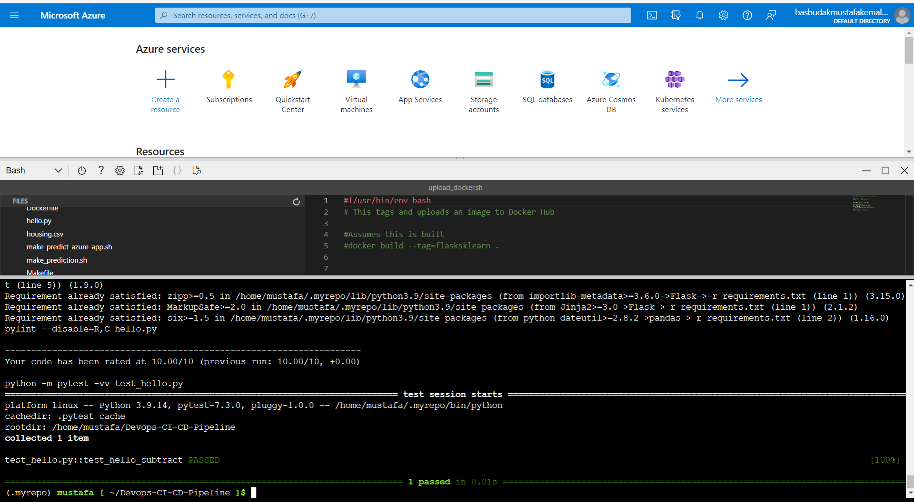

Run the application locally:
```bash
(.myrepo) mustafa [~/Shell-CI-CD]$ flask run
```

Test the code locally in new Azure Bash:
```bash
mustafa [~]$ source ~/.myrepo/bin/activate
(.myrepo) mustafa [~]$ cd flask-project/
(.myrepo) mustafa [~/Shell-CI-CD]$ ./make_prediction.sh
```

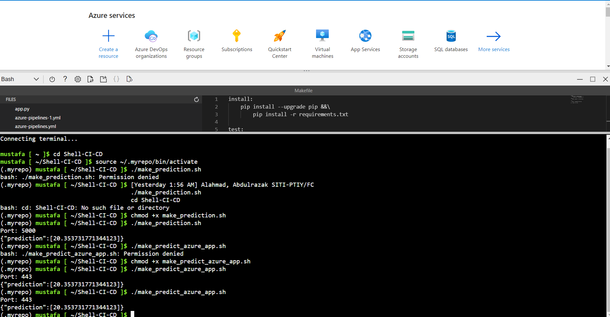


### Provisioning CI using Github Actions
Performe CI by using GitHub Action.

From the top bar of GitHub click on 'Actions', then click on "set up a workflow yourself' and use the GitHub Actions template yaml file located in  ".github/workflows/main.yml-"

Once you create this workflow, it will run automatically to build code in Repo

Passing GitHub Actions:
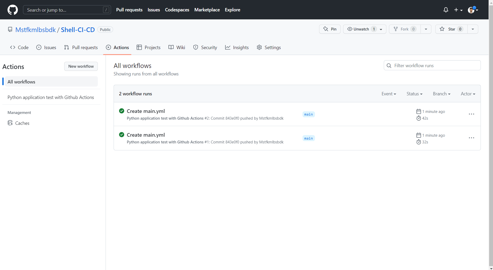


### Deploying to Azure App Services

Deploy app to Azure app services locally using Azure CLI:

```bash
(.myrepo) mustafa [~/Shell-CI-CD]$ az webapp up --sku F1 --name m-kemal --resource-group Azuredevops --runtime "PYTHON:3.10"
```

Check app by using the link from the previous step:

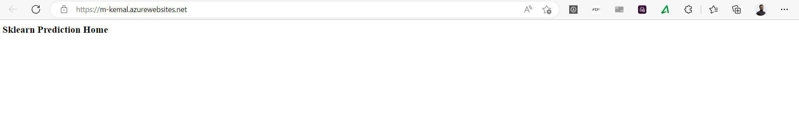

Test the online app by invoke 'make_predict_azure_app.sh'  modify webapp name in the file
Edit file 'make_predict_azure_app.sh' and replace '< yourappname >' with your webapp name (exapmle: m-kemal).

Test the remote webapp:
```bash
(.myrepo) mustafa [~/Shell-CI-CD]$  ./make_predict_azure_app.sh
```


Logs of webapp can be easily done by tail linux command:

open cloud shell bash

```bash
(.myrepo) mustafa [~/Shell-CI-CD]$ az webapp log tail
```

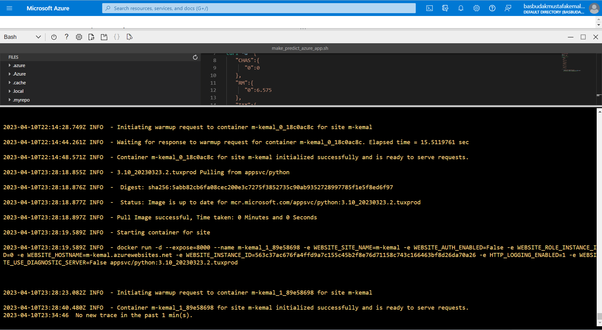

validation of the webapp can be performed using [locust](https://locust.io).

Install locust tool 

```bash
(.myrepo) mustafa [~/Shell-CI-CD]$ pip install locust
```
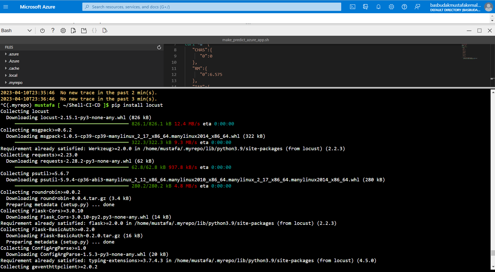

Open Template file 'locustinput.py' and Replace '< yourappname >':

```bash
(.myrepo) mustafa [~/Shell-CI-CD]$ nano locustinput.py
(.myrepo) mustafa [~/Shell-CI-CD]$ locust -f locustinput.py --headless -u 10 -r 3 -t 10s
```

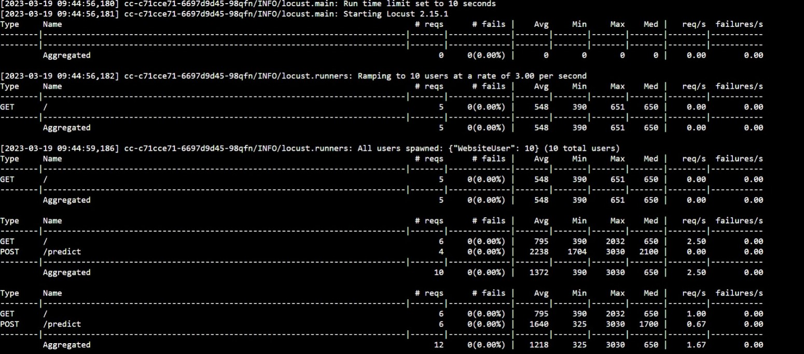


### Provisioning CI/CD using Azure Pipelines

This pipeline will get the code from GitHub Repo and do all operations building, testing and deployment.

Go to Azure devops from your Azure account  https://dev.azure.com.

Create a New Project.

Click on 'New pipeline' from the left panel.

Link your GitHub Repo to pipeline

Configure pipeline to deploy code to Azure app service 'that created in previous stage' by providing suitable inputs according to your Azure subscribtion

run the pipeline including the 'Build stage' and the 'Deploy Web App' based on yaml file:

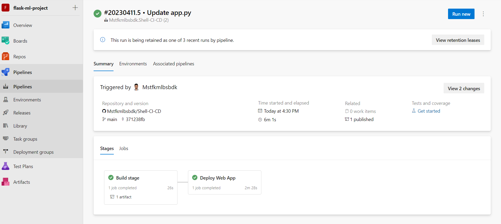

View pipeline log by click on build icon

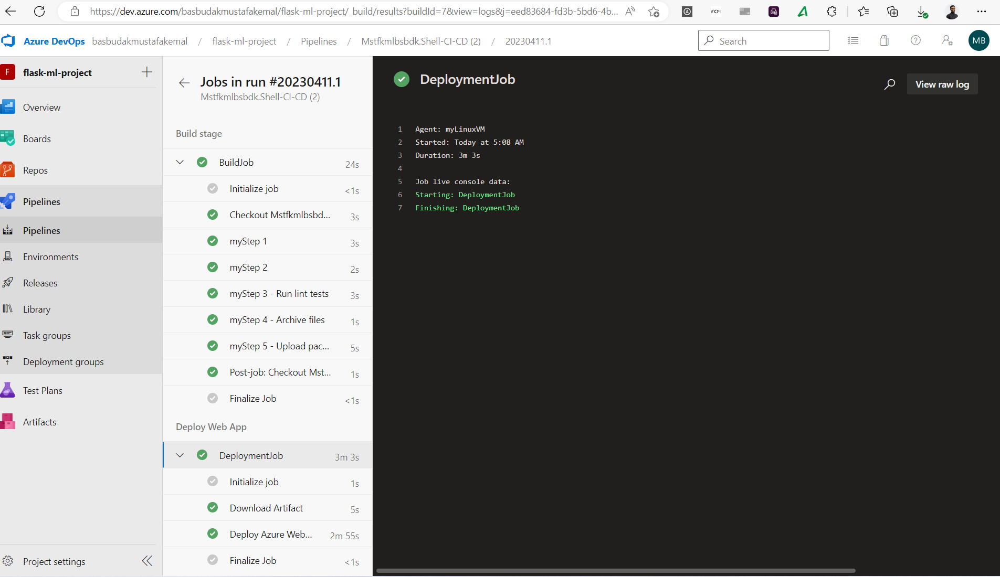

From now on every change to your code will trigger the CI/CD pipeline and update your webapp accordingly:

Change the application name in app.py from 'Sklearn Prediction Home' to 'Sklearn Prediction Home Edited' and commit it:

```bash
(.myrepo) mustafa [~/Shell-CI-CD]$ git add app.py && git commit -m "Change app name" && git push
```
App name before changing:

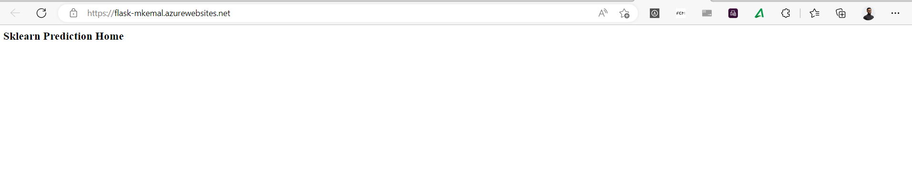

App name after changing:

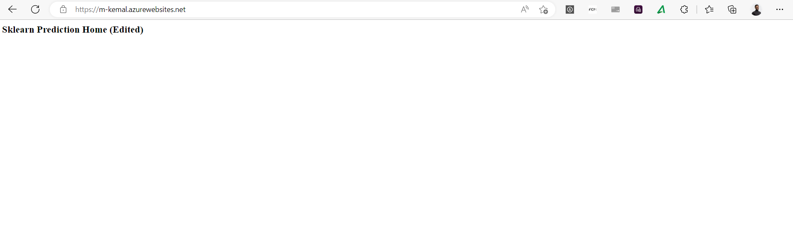


The pipeline is triggered by each commit to GitHub Repo and actually that is the CI/CD
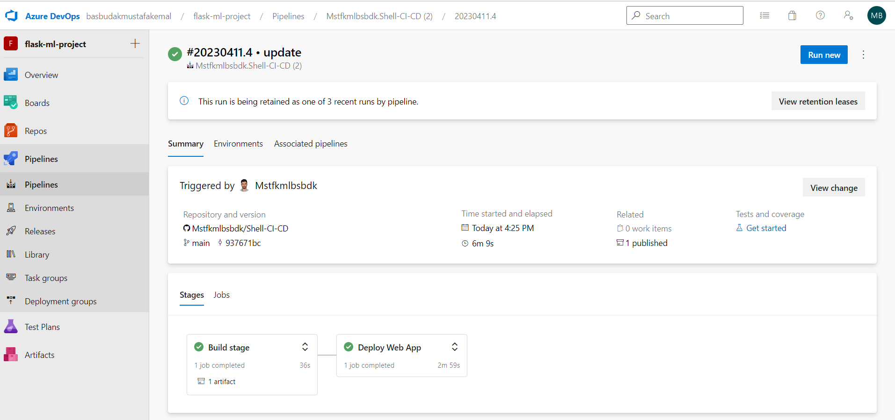
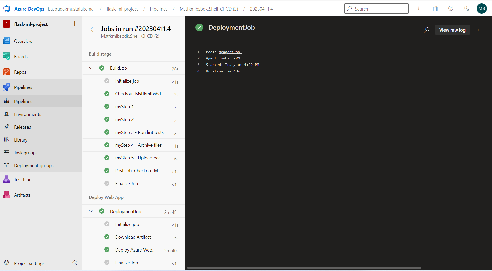

## Enhancements
Future improvements include but are not limited to:
* We can show our house price prediction on the webapp as GUI.
* Preform automatically testing using testing module such as locust.


## Demo

This video demonstrates all previous steps:
[Demo Video](https://www.youtube.com/watch?v=7WVkz0Brn0E)


<TODO:  Instructions for running the Python project.  How could a user with no context run this project without asking you for any help.  Include screenshots with explicit steps to create that work. Be sure to at least include the following screenshots:

* Project running on Azure App Service

* Project cloned into Azure Cloud Shell

* Passing tests that are displayed after running the `make all` command from the `Makefile`

* Output of a test run

* Successful deploy of the project in Azure Pipelines.  [Note the official documentation should be referred to and double checked as you setup CI/CD](https://docs.microsoft.com/en-us/azure/devops/pipelines/ecosystems/python-webapp?view=azure-devops).

* Running Azure App Service from Azure Pipelines automatic deployment

* Successful prediction from deployed flask app in Azure Cloud Shell.  [Use this file as a template for the deployed prediction](https://github.com/udacity/nd082-Azure-Cloud-DevOps-Starter-Code/blob/master/C2-AgileDevelopmentwithAzure/project/starter_files/flask-sklearn/make_predict_azure_app.sh).
The output should look similar to this:

```bash
udacity@Azure:~$ ./make_predict_azure_app.sh
Port: 443
{"prediction":[20.35373177134412]}
```

* Output of streamed log files from deployed application

> 

## Enhancements

<TODO: A short description of how to improve the project in the future>

## Demo 

<TODO: Add link Screencast on YouTube>


